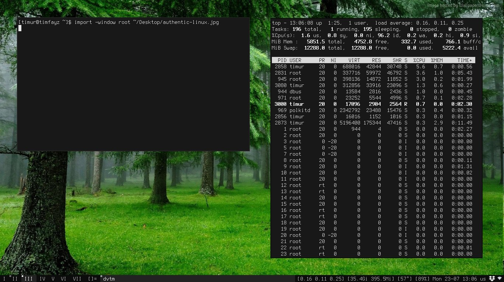

# Authentic Linux 🌱 



Want to install Linux *the hard way*? Love minimalism, simplicity and mindfulness of what's going on under the hood? Authentic Linux is what you need! :] Be carefull, congnitive load is higher than usual! So don't try to do it *one* day/week/month. Be patient, calm and detached. If it burdens you - f\*ck it!

## Intro
If to be *serious* Sam, Authentic Linux is based on the best practices from many well-known resources like IBM developerWorks, Arch Wiki, etc. Full list of resources can be found [here]. I tried to find a "golden" mix between awareness of what you do, visual aesthetics, comfortable user experience on the daily basis & manual work to achieve it all. You don't find anything building from sources unless there is no way but do it. We will always try to configure something just out of the box if it's possible. 

## Message to newbies
This manual is a message to myself in the past. Don't try to know & do *everything* in Linux manually! Believe me, otherwise one day you just remain a depressed nerd surrounded by burdensome thoughts. At the end no one knows what's actually going on under the hood (even Linus T. itself). Since the time of Alan Turing and punch cards are gone - no one capable to do so at the current scale. Thus, always keep in mind - *no one* can know everything; only some pieces either wide or narrow. It's much better to know *enough* to ask a person who know *his/her* part of a subject and thus, forming kind of network of "resources" where you can ask further issues in question.

## Features
* Low memory footprint (~Xmb)
* Visually consistant (one color & font scheme)
* Backed by the most supported software stack

## Stack
All the stack was carefully selected under the following conditions: simplicity, small footprint, ...

[base]
* Syslinux - as bootloader for any Linux distribution
* Void Linux - as a base distribution and package manager
* Xorg - as display server
* dwm - as tiling window manager (WM)
* slstatus - status bar to print system info in both tmux/DWM (CPU load, time, etc)
* st - as terminal emulator
* tmux - as terminal multiplexer (regardless of GUI/console mode)
* vis - as main text-editor
* vscode - as IDE
* firefox - as a browser

[toolbox]
* openntpd - to set system time from internet

## Unified color experience
In the course of code editor evolution there are several themes trying to unify experience accross different platforms and applications. One of them is base16[link]. I find it very distinguishable, crisp and nutural. Other ones are Dracula[link], ?. Color themes are matter of preferences. However, as for me one of the most important aspect was *consistence* across the apps. Also, I don't like palette colors and trasitional (neither blue or black but opaque mix of them). I prefer either "dark" theme with quite good contrast and "light" where background would indeed white. Here are examples:

[dark]
[white]
[solarized]
[high contrast]
[palette]

As in my Authentic Linux I stick with dark & white color themes.

## Legend
* `[--flag]` - optional flag. Shown to be clear what's implied.

## Create Live USB
### Get USB stick and plug it

*(!) all data will be destroyed*

Linux
```bash
# mount
sudo mount /dev/sdx /mnt
# go https://repo.voidlinux.eu/live/current/ and get the latest Void Linux
cd ~/Downloads
sudo dd bs=4M if=void-live-x86_64-20171007.iso of=/dev/sdx && sync
```

Windows
```
Get uniboot
```

### Reboot and boot from the media

Now you're in
```bash
...

voidlinux login: |
# login root
# password voidlinux
```

Set correct system & hardware time
```bash
# show Hardware Clock
hwclock [--show] # if `Cannot access the Hardware Clock via ..` hwclock --directisa
# show System Clock
date
# compare
# a. if the only system is correct
hwclock --systohc
# b. if only hardware is correct
hwclock --hctosys
# c. if you want to set hardware clock manually
hwclock --set [--utc] --date='16:25' # or --date='2020-08-05 16:25:59'
#    repeat b; done.
# d. if you want to set system clock manually
date --date='16:25' # or --date='2020-08-05 16:25:59'
#    repeat a; done.
# e. if you want to set system clock from internet
xbps-install openntpd
ln -s /etc/sv/openntpd /var/service/
#    now ntpd daemon is running; repeat a; done.
```

### Prepare package manager
TODO
```
prepare package manager
vi /etc/xbps.d/timfayz.conf >> “repository=http://…”
xbps-install -Su
```

### Color experience across the apps
* Expain how to setup base16 for nvim, st, code

### Set, test and capture VT/Terminal color scheme
* Use https://github.com/EvanPurkhiser/linux-vt-setcolors <br>
(set VT colorscheme)
* https://github.com/chriskempson/base16-shell
(show VT colorscheme)
* https://bisqwit.iki.fi/source/snapscreenshot.html <br>
(take VT screenshots) `./configure && make install`

### Font experience across the apps
Explain how to setup fonts in VT, X11 in general and other apps.

* Download Terminus font https://files.ax86.net/terminus-ttf/#download
* `sudo fc-cache`
* `vi ~/.config/fontconfig/fonts.conf` -> "Terminus (TTF)"

### Keep user preference in tact
Explain how to backup everything into `donfiles`
